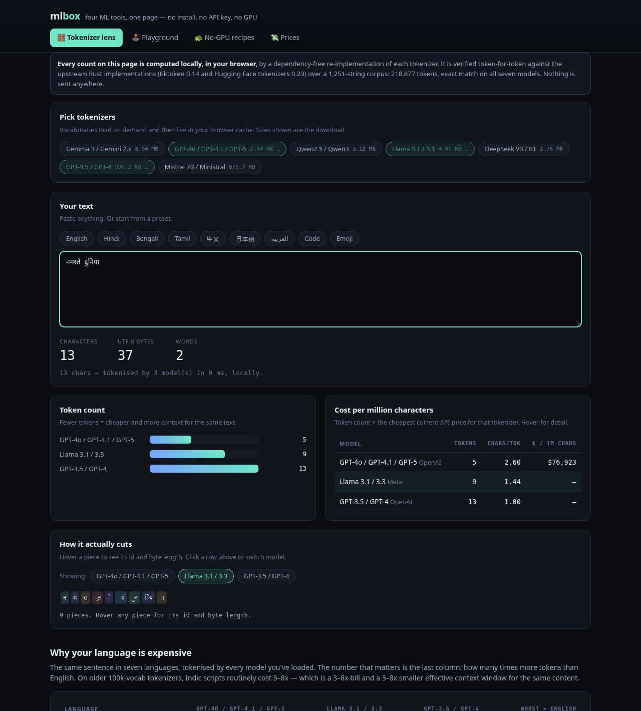

# mlbox

**The browser workbench for LLM tokenizers, training intuition, and API pricing.**
Four tools, one static page, zero dependencies — every number measured in your own browser, none remembered from a blog post.

<p>
  
  
  
  
  
</p>

**Live: <https://mohittt-vermaa.github.io/mlbox/>** — no install, no API key, no GPU, no backend. Your text never leaves your machine.

> ⭐ **If mlbox is useful to you, star the repo** — it's the single best way to help other people find it. [→ github.com/mohittt-vermaa/mlbox](https://github.com/mohittt-vermaa/mlbox)

---

## What's inside

| Tool | What it does |
|---|---|
| 🧮 **Tokenizer lens** | Paste any text. Watch 7 real LLM tokenizers cut it up, token by token — counts, $/million chars, a language cost matrix, a **boundary diff between any two tokenizers**, and a shareable link that freezes the whole comparison. |
| 🕹️ **Micro playground** | A neural net with hand-written backprop training live on canvas. Watch gradient descent solve XOR — and honestly get stuck in the spiral. |
| 🐢 **No-GPU recipes** | 12 curated ML projects that genuinely finish on a laptop or a free Colab session, each with its one gotcha spelled out. |
| 💸 **LLM price bench** | 13 current models from 5 providers, transcribed from each provider's own pricing page (with per-row source links), a workload calculator, and a **real-prompt estimator** that tokenizes the prompt you actually ship. |

## The number that motivates all of this

Paste *"नमस्ते दुनिया"* ("hello world" in Hindi — 13 characters) and the tokenizers disagree:

| Tokenizer | Tokens | chars/token |
|---|---:|---:|
| o200k (GPT-4o / 4.1 / 5) | **5** | 2.60 |
| DeepSeek V3 | 7 | 1.86 |
| Llama 3.1 | 9 | 1.44 |
| cl100k (GPT-3.5 / 4) | **13** | 1.00 |
| Mistral 7B | 14 | 0.93 |

Same two words, nearly **3× the bill** depending on which tokenizer sits in front. A full Hindi
paragraph is starker: 176 characters → 185 tokens on cl100k but 64 on o200k — almost one token
per character versus ~0.19 for English. Token choice is a cost multiplier and a context-window
multiplier, and almost nobody looks at it. Now you can, in one link.

<p align="center">
  
</p>

---

## New in this release

- **Tokenizer boundary diff.** Pick any two models: the same text is rendered with every token
  start marked, and positions where only one model splits are highlighted — the exact places
  where your bill and your context window diverge.
- **Shareable comparisons.** One click encodes your text, model selection, and view into the URL
  (`#tab=tokenizer&data=…`). Send the link; the recipient sees your exact comparison.
- **Real-prompt cost estimator.** Paste the system prompt you actually ship, set requests/month
  and average output tokens, and every model is priced with a **measured** input-token count
  (each model priced with its own tokenizer where we ship one; remaining rows are labelled
  *(est.)* rather than pretending).
- **Shareable state across tabs** — the hash scheme (`#tab=…`) makes any tab deep-linkable.

## The tokenizer engine is verified, not approximate

`js/tokenizer.js` re-implements both BPE families — tiktoken's rank-merge BPE and Hugging Face's
byte-level / metaspace BPE, including added tokens, byte-fallback, and preprocessing — in ~550
lines of dependency-free JavaScript. `npm test` asserts it **token-for-token against the upstream
Rust implementations** (`tiktoken` 0.14, HF `tokenizers` 0.23) over a 1,251-string multilingual
corpus:

```
  PASS  gemma3    1251 strings   27,557 tokens
  PASS  o200k     1251 strings   28,626 tokens
  PASS  qwen25    1251 strings   28,358 tokens
  PASS  llama3    1251 strings   31,434 tokens
  PASS  deepseek  1251 strings   29,394 tokens
  PASS  cl100k    1251 strings   36,394 tokens
  PASS  mistral   1251 strings   37,114 tokens

  ✓ 218,877 tokens, exact match on all seven models, zero dropped characters
```

The playground is asserted too: `npm run test:playground` fails unless the MLP actually converges
on every bundled dataset (and *fails to* converge where it should, e.g. one hidden unit on the spiral).
`npm run test:browser` drives the deployed site in headless Chrome — 21 end-to-end checks,
including the diff view, share-link round-trip, and zero console errors.

## Run it on any device

There is nothing to compile. Any of these gets you a running mlbox in under a minute — pick whatever your machine already has.

| You have… | Do this | Works on |
|---|---|---|
| Nothing to install | Open <https://mohittt-vermaa.github.io/mlbox/> | every device with a browser |
| Python 3 (macOS, most Linux) | `git clone https://github.com/mohittt-vermaa/mlbox && cd mlbox && python3 -m http.server 8000` → open `http://localhost:8000` | macOS · Linux · Windows (with Python) |
| Python 2 | `python -m SimpleHTTPServer 8000` | older systems |
| Node.js | `git clone https://github.com/mohittt-vermaa/mlbox && cd mlbox && npx serve .` | any OS |
| PHP | `git clone https://github.com/mohittt-vermaa/mlbox && cd mlbox && php -S localhost:8000` | any OS |
| Docker | `git clone https://github.com/mohittt-vermaa/mlbox && cd mlbox && docker run --rm -p 8000:80 -v "$PWD:/usr/share/nginx/html:ro" nginx:alpine` | any OS with Docker |
| Ruby | `cd mlbox && ruby -run -e httpd . -p 8000` | macOS / Linux |
| Just the files | `git clone …` and double-click `index.html`* | Windows · macOS · Linux |
| A phone / tablet | Open the live link → browser menu → **Add to Home Screen** | iOS · Android |

\* Opening `index.html` directly (`file://`) works for the playground, recipes and prices tabs.
The tokenizer tabs load vocabulary JSON, which browsers block over `file://` — use any of the
one-liners above instead.

**Windows (PowerShell) in full, copy-paste:**

```powershell
git clone https://github.com/mohittt-vermaa/mlbox
cd mlbox
python -m http.server 8000     # or: npx serve .
start http://localhost:8000
```

**macOS / Linux (terminal), copy-paste:**

```bash
git clone https://github.com/mohittt-vermaa/mlbox
cd mlbox
python3 -m http.server 8000    # or: npx serve .
open http://localhost:8000     # Linux: xdg-open http://localhost:8000
```

Want it on your own URL instead of localhost? Push your fork to GitHub and enable **Pages**
(it's a plain static site; `.nojekyll` is included) — or drop the folder on Netlify/Vercel/S3.
There is no build step anywhere.

## Architecture

```
index.html          single-page shell, 4 tabs
css/styles.css      dark UI, no framework
js/lib.js           tiny DOM/chart helpers (no chart library)
js/tokenizer.js     the BPE engine (tiktoken + byte-level + metaspace, added tokens, offsets)
js/*-tab.js         one module per tab; lazy-mounted on first visit
data/models.json    manifest (which tokenizers exist, vocab file per model)
data/tok/*.json     vocab bundles, loaded on demand and cached (~24 MB total)
data/pricing.json   13 models, per-row source URL + check date
data/recipes.json   the no-GPU project list
tests/              engine-vs-Rust, convergence, full browser e2e
tools/              python scripts to regenerate all data from primary sources
```

Design decisions, in one line each:

- **No build, no deps.** Vanilla ES modules; `git clone` and open. The engine is readable in one sitting.
- **Lazy loading.** Only the vocabularies you select are fetched; the browser cache does the rest.
- **No backend, no analytics, no runtime CDN.** Nothing leaves your machine.
- **Honest numbers.** Prices are transcribed from official pages on a stated date, with sources;
  estimators say *estimated* when they estimate.

## Tests

```bash
npm run test:tokenizer     # engine vs upstream Rust: 218,877 tokens, exact
npm run test:playground    # MLP convergence on all bundled datasets
npm run test:browser       # 21 e2e checks in headless Chrome (needs: npm i -D puppeteer)
                           # URL=https://... runs the suite against any deployment
```

## Regenerating data

```bash
python3 tools/fetch_models.py       # download upstream tokenizer artifacts (~70 MB, gitignored)
python3 tools/build_tokenizers.py   # rebuild data/tok/*.json + data/models.json
python3 tools/gen_reference.py      # rebuild the ground-truth corpus for tests
```

## Roadmap

- More tokenizers (Claude's BPE, Cohere Command).
- Cache-hit pricing scenarios in the estimator (cached-input multipliers differ by provider).
- `localStorage` persistence of your working text and selection.

## License & data

Code is **MIT**. Vocabulary bundles in `data/tok/` are derived from upstream model artifacts and
remain under their original licenses (Llama 3.1 Community, Apache-2.0, MIT, Gemma ToU) — see
[`NOTICE.md`](NOTICE.md). Pricing is transcribed from providers' own pages on the date shown in
the app and is for reference only — check the source link before you invoice anything.

---

<p align="center">
  <b>If this tool helped you, please ⭐ <a href="https://github.com/mohittt-vermaa/mlbox">star the repo</a> — it's free, and it's how this project reaches the next person.</b><br>
  Found a bug or want another tokenizer? <a href="https://github.com/mohittt-vermaa/mlbox/issues">Open an issue</a> — every one gets read.
</p>
