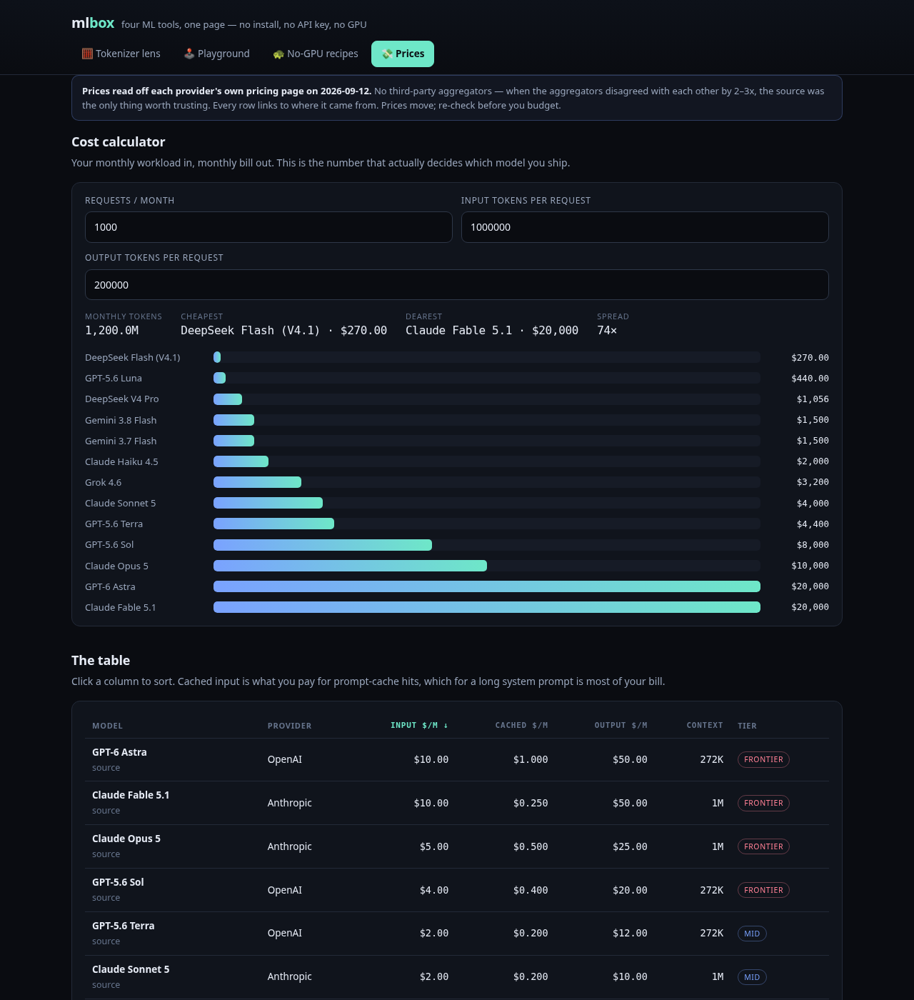
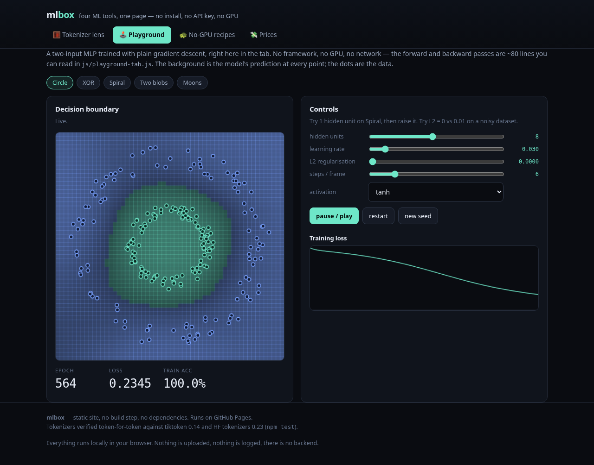

# mlbox — four ML tools in one page

> No install. No API key. No GPU. Everything runs **locally in your browser**, and every
> number is *measured*, not memorised.

<p>
  
  
  
  
  
</p>

`mlbox` packs the four things every ML beginner actually needs into one static site that
runs on GitHub Pages:

1. **🧮 Tokenizer lens** — paste any text and see exactly how 7 real LLM tokenizers cut it up,
   how many tokens each costs, and what that costs in dollars.
2. **🕹️ Playground** — a neural net trained with plain gradient descent, live, in the tab.
3. **🐢 No-GPU recipes** — a curated set of real ML projects you can finish on a laptop / free Colab.
4. **💸 Prices** — current LLM API prices transcribed from each provider's own pricing page, plus a cost calculator.

There is no build step, no bundler, no framework, and no dependencies. It's plain HTML, CSS and
ES-module JavaScript. You can `git clone` it and open it.

---

## The number that made me build this

Paste *"नमस्ते दुनिया"* (Hindi for *"hello world"* — 13 characters, 2 words) and watch the
tokenizers disagree:

| Model | Tokens | chars/token |
|---|---:|---:|
| GPT-4o / GPT-5 (o200k) | **5** | 2.60 |
| DeepSeek V3 | 7 | 1.86 |
| Llama 3.1 | 9 | 1.44 |
| GPT-3.5 / GPT-4 (cl100k) | **13** | 1.00 |
| Mistral 7B | 14 | 0.93 |

Two words. On the GPT-4 tokenizer it costs **2.6×** the GPT-4o tokenizer, and on the Mistral
tokenizer nearly **3×**. A longer Hindi paragraph is even starker: 176 characters costs **185
tokens** on cl100k (GPT-3.5/4) but **64** on o200k (GPT-4o) — almost **1 token per character**,
versus ~0.19 for English. That's a 3–8× bill and a 3–8× smaller effective context window for the
*same content*, just because of a tokenizer. This is the whole reason token counts deserve a UI.

<p align="center">
  
</p>

---

## 🧮 Tokenizer lens

- Compare **7 real tokenizers**: GPT-3.5/4 (cl100k), GPT-4o/4.1/5 (o200k), Llama 3.1/3.3,
  Qwen2.5/Qwen3, DeepSeek V3/R1, Gemma 3 / Gemini 2.x, and Mistral.
- Token count, chars/token, bytes/token, and **$ per million characters** (count × the cheapest
  current API price for that tokenizer).
- A **hoverable token visualiser** — every piece is shown, with its id and byte length.
- A **language cost matrix**: the same sentence in 7 languages, with the "× vs English" multiplier.
- Presets for English, Hindi, Bengali, Tamil, Chinese, Japanese, Arabic, code and emoji.

<p align="center">
  
</p>

### It is verified, not approximate

This is not a heuristic counter. `js/tokenizer.js` re-implements the two BPE families (tiktoken's
rank-merge and Hugging Face's byte-level / metaspace BPE, including added-token and byte-fallback
handling), and `npm test` asserts it **token-for-token against the upstream Rust implementations**
(`tiktoken` 0.14 and HF `tokenizers` 0.23) over a 1,251-string multilingual corpus:
**218,877 tokens, exact match on all seven models, zero dropped characters.**

```
  PASS  gemma3    1251 strings   27,557 tokens
  PASS  o200k     1251 strings   28,626 tokens
  PASS  qwen25    1251 strings   28,358 tokens
  PASS  llama3    1251 strings   31,434 tokens
  PASS  deepseek  1251 strings   29,394 tokens
  PASS  cl100k    1251 strings   36,394 tokens
  PASS  mistral   1251 strings   37,114 tokens
  ✓ every model matches the upstream Rust tokenizer exactly
```

## 🕹️ Playground

A ~120-line two-input MLP trained with hand-written backprop, rendered as a live decision boundary.
Five datasets (circle, XOR, spiral, blobs, moons), sliders for hidden units / learning rate / L2 /
activation, a loss curve, and a **"new seed"** button that honestly shows gradient descent getting
stuck in the spiral's local minima. `npm run test:playground` asserts it actually learns each dataset.

<p align="center">
  
</p>

## 🐢 No-GPU recipes & 💸 Prices

- **Recipes**: grokking, nanoGPT-from-scratch, training your own BPE tokenizer, LoRA on CPU,
  distillation, tiny diffusion, NumPy backprop, gradient boosting, DQN, embeddings, and free-GPU
  session discipline. Each says *why* it fits on a laptop, what you'll learn, and the one gotcha.
- **Prices**: 13 current models across OpenAI, Anthropic, Google, DeepSeek and xAI, transcribed from
  each provider's official pricing page on 2026-09-12 with per-row source links, plus a monthly
  workload cost calculator. When third-party aggregators disagreed by 2–3×, the official page won.

---

## Quickstart

```bash
git clone <your-fork-url> && cd mlbox
python3 -m http.server 8000        # any static server works
open http://localhost:8000
```

Or push to GitHub and enable **Pages** (it's a plain static site; a `.nojekyll` is included).

### Tests

```bash
npm run test:tokenizer     # JS engine vs upstream Rust, 218k tokens
npm run test:playground    # MLP converges on all datasets
npm run test:browser       # full end-to-end in headless Chrome (needs: npm i -D puppeteer)
```

### Regenerating the data (optional)

The `data/tok/*.json` bundles are checked in so the site works offline. To rebuild them from the
primary sources instead:

```bash
python3 tools/fetch_models.py       # downloads upstream tokenizer files (~70 MB, not committed)
python3 tools/build_tokenizers.py   # emits data/tok/*.json + data/models.json
python3 tools/gen_reference.py      # regenerates the ground-truth corpus for the tests
```

## How it works

- **No build, no deps.** Vanilla ES modules. The tokenizer engine is ~450 lines you can read in
  `js/tokenizer.js`.
- **Vocabularies load on demand** (they're a few MB each) and are cached by the browser. Only the
  models you pick are fetched.
- **Nothing leaves your machine.** There is no backend, no analytics, no CDN dependency at runtime.
- Charts and the playground boundary are hand-rolled canvas/SVG — no chart library.

## License & data

Code is **MIT**. The vocabulary bundles under `data/tok/` are derived from upstream model artifacts
and remain under their original licenses (Llama 3.1 Community, Apache-2.0, MIT, Gemma ToU) — see
[`NOTICE.md`](NOTICE.md). Pricing is transcribed from providers' own pages and is for reference only.

## Ideas / contributing

- Add more tokenizers (Claude's BPE, Cohere, Gemini 2.0).
- A "diff" view: highlight exactly where two tokenizers split the same text differently.
- Persist your last text + selection in `localStorage`.
- A shareable URL (`#text=…`) so a comparison is one link.
